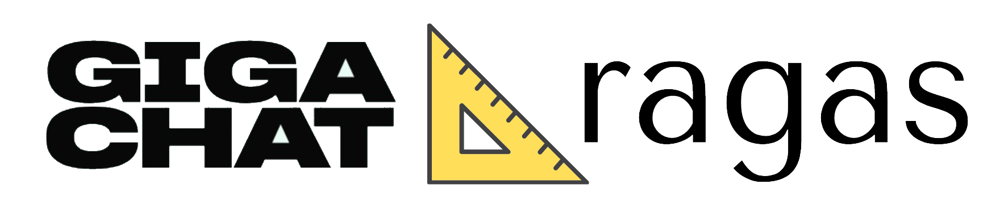

<h1 align="center">
  
</h1>
<p align="center">
  <i>Фреймворк для оценки RAG-систем (Retrieval Augmented Generation), адаптируемый под GigaChat</i>
</p>

<p align="center">
    <a href="https://www.python.org/">
            
    </a>
    <a href="https://github.com/ai-forever/gigaragas/blob/main/LICENSE">
        
    </a>
</p>

GigaRagas - расширение библиотеки [Ragas](https://github.com/explodinggradients/ragas) для работы с LLM GigaChat. 

Ragas - фреймфорк для оценки RAG-пайплайнов (Retrieval Augmented Generation). RAG это подход, который позволяет использовать внешние дополнительные данные, в контексте которых LLM формирует свой ответ. На данный момент существуют фреймворки, с помощью которых можно создавать RAG-системы, однако их качественная или количественная оценка может оказаться нетривиальной задачей. Ragas (RAG Assessment) частично закрывает эту потребность.

Ragas представляет из себя набор метрик, которыми оценивается RAG. Основные метрики Ragas вычисляются из анализа ответа LLM на специально подготовленные промпты, которые могут включать некоторые из 4х основных компонентов для анализа RAG-систем: 

- Вопрос (question)
- Ответ (answer)
- Контекст (contexts)
- Истинный ответ (ground_truth)

> Важно заметить, что основным метрикам истинный ответ не нужен.
> 
> Подробнее можно узнать в оригинальной [статье](https://arxiv.org/abs/2309.15217).

GigaRagas адаптирует фреймфорк под более предсказуемую работу с LLM GigaChat и русским языком в целом посредством перевода промтов на русский.  


## Установка

```bash
git clone https://github.com/ai-forever/gigaragas.git
cd gigaragas
python -m venv venv
pip install .
```


## Quickstart

Пример использования GigaChat модели и GigaChat-эмбеддингов для ragas:

```python

from datasets import Dataset 

from langchain.chat_models import GigaChat
from langchain_community.embeddings import GigaChatEmbeddings

from ragas import evaluate, RunConfig
from ragas.metrics import faithfulness_ru,  answer_relevancy_ru

data_samples = {
    'question': ['Кто снял фильм «Оппенгеймер» и кто сыграл роль Дж. Роберта Оппенгеймера в фильме?'],
    'answer': ['Кристофер Нолан снял фильм "Оппенгеймер". Брэд Питт исполнил роль Дж. Роберта Оппенгеймера.'],
    'contexts' : [["""«Оппенгеймер» (англ. Oppenheimer) — эпический биографический триллер режиссёра и сценариста Кристофера Нолана, который рассказывает о создателе атомной бомбы Роберте Оппенгеймере. Фильм основан на документальной книге Кая Бёрда и Мартина Шервина «Оппенгеймер. Триумф и трагедия Американского Прометея». Фильм повествует о жизни Дж. Роберта Оппенгеймера, теоретического физика, сыгравшего решающую роль в разработке первых ядерных вооружений в рамках Манхэттенского проекта, который привел к началу атомной эры. Киллиан Мёрфи играет роль Оппенгеймера, Эмили Блант - роль его жены Кэтрин "Китти" Оппенгеймер, Мэтт Деймон - роль генерала Лесли Гроувса, директора Манхэттенского проекта, а Роберт Дауни-младший - роль Льюиса Штрауса, старшего члена Комиссии по атомной энергии США. Мёрфи согласился сыграть роль Оппенгеймера в октябре, а другие актёры основного состава присоединились между ноябрем 2021 года и апрелем 2022 года. Подготовка к съёмкам началась в январе 2022 года, а съёмки проходили с февраля по май."""]],
    'ground_truth': ['Кристофер Нолан снял фильм "Оппенгеймер". В этом фильме Киллиан Мёрфи играет роль Дж. Роберта Оппенгеймера.']
}

dataset = Dataset.from_dict(data_samples)

llm = GigaChat(
    credentials="<авторизационные_данные>",
    scope="GIGACHAT_API_PERS",
    model='GigaChat-Pro', 
    verify_ssl_certs=False,
    temperature=0.1
)

# Следует отдельно задать тип эмбеддингов. В качестве альтернативы эмбеддингам GigaChat 
# можно также использовать эмбеддинги HuggingFace
embeddings = GigaChatEmbeddings(
    credentials="<авторизационные_данные>", 
    scope="GIGACHAT_API_PERS", 
    verify_ssl_certs=False
)

score = evaluate(
    dataset=dataset, 
    metrics=[faithfulness_ru, answer_relevancy_ru],
    llm=llm,
    embeddings=embeddings,
    run_config=RunConfig(max_workers=1)
)
score.to_pandas()
```

Ссылка на оригинальную [документацию RAGAS](https://docs.ragas.io/).
